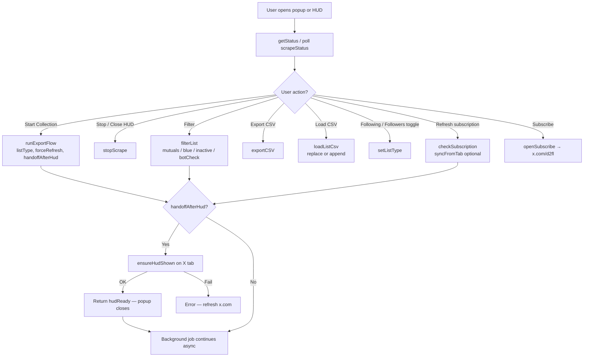
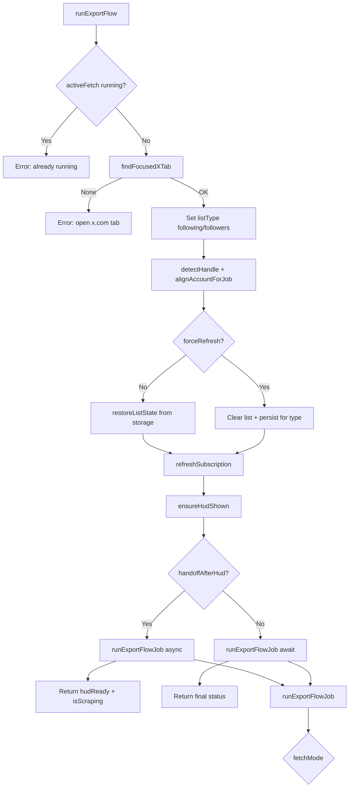
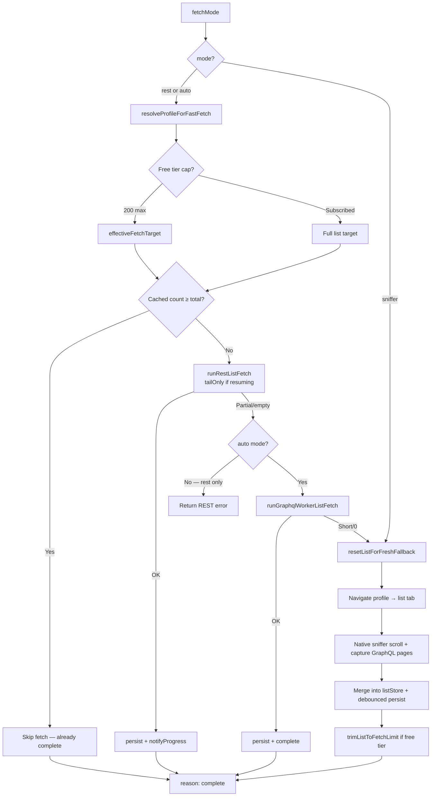
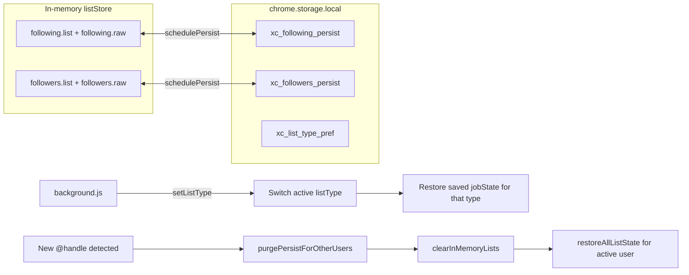
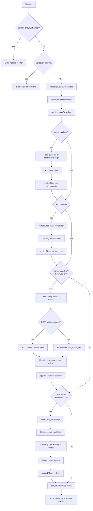
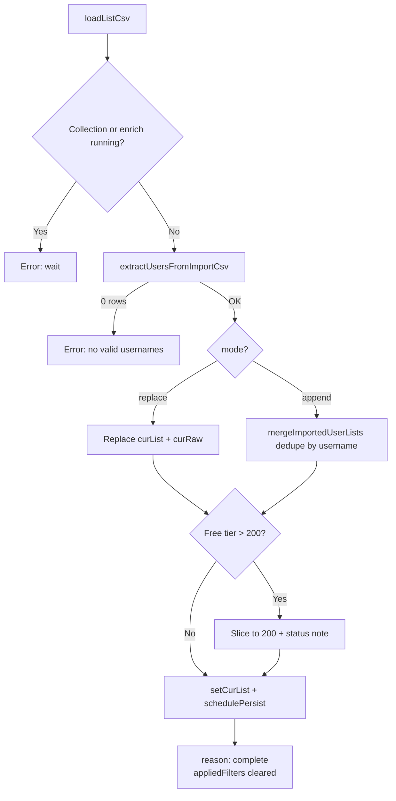
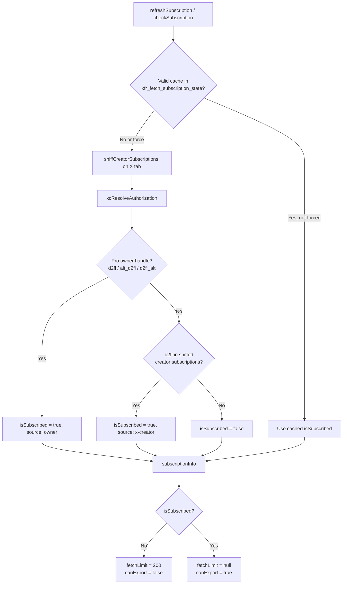
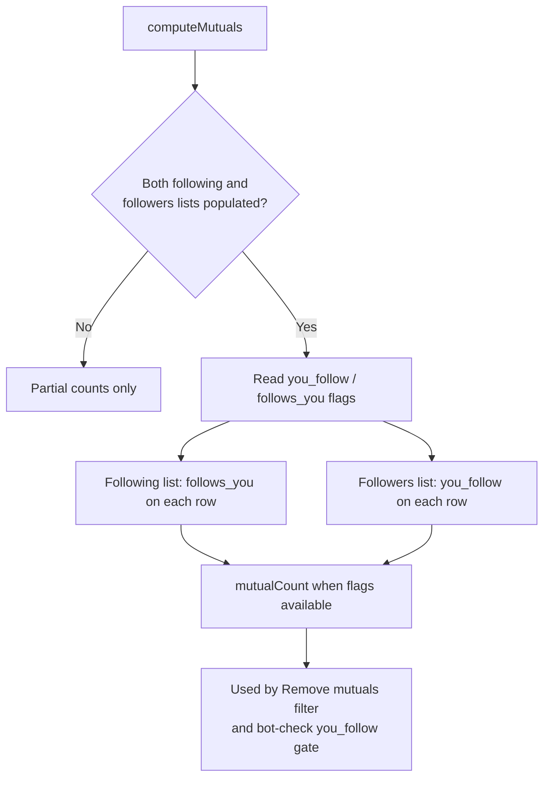
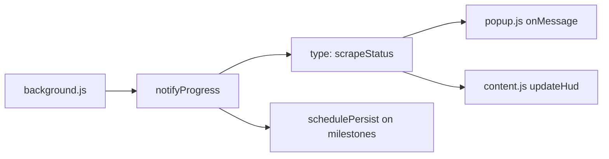

# X Cleaner — Code Flow (v0.86)

Flowcharts for documentation. Renders in GitHub, Notion, VS Code (Mermaid), and most modern doc tools.

---

## 1. High-level architecture

```mermaid
flowchart TB
  subgraph Entry["Entry points"]
    POP[Extension popup<br/>popup.html + popup.js]
    HUD[On-page HUD<br/>content.js]
    BG[Service worker<br/>background.js]
  end

  subgraph ContentScripts["Content scripts on x.com"]
    SNIFF[xc-fetch-sniffer.js<br/>MAIN world — capture GraphQL]
    BRIDGE[xc-rest-bridge.js<br/>REST session bridge]
    CS[content.js<br/>HUD UI + message relay]
  end

  subgraph FetchLibs["Imported modules"]
    API[api-fetch.js<br/>GraphQL worker + inject helpers]
    REST[rest-fetch.js<br/>REST v1.1 list fetch]
    SUB[subscription.js<br/>@d2fl gate + owner handles]
  end

  subgraph Storage["Persistence"]
    LOCAL[(chrome.storage.local<br/>xc_following_persist<br/>xc_followers_persist<br/>xc_activity_cache<br/>xc_enrich_archive<br/>xfr_fetch_subscription_state)]
  end

  POP -->|runtime.sendMessage| BG
  HUD -->|runtime.sendMessage| BG
  BG --> API
  BG --> REST
  BG --> SUB
  BG <-->|persist / restore lists| LOCAL
  BG -->|tabs.sendMessage| CS
  BG -->|executeScript / inject| SNIFF
  BG -->|executeScript / inject| BRIDGE
  CS --> HUD
  BG -->|scrapeStatus broadcast| POP
  BG -->|updateHud| CS
```

---

## 2. Popup / HUD → background actions



---

## 3. Collection flow (`runExportFlow`)



---

## 4. Fetch mode cascade (auto)



---

## 5. Dual-list storage & account switch



---

## 6. Filter pipeline (`filterList`)



**Bot-check signals:** default avatar, no bio, &lt;10 tweets, account &lt;30 days, @handle ending with &gt;4 digits, followers &gt;2× following.

---

## 7. CSV import (`loadListCsv`)



Accepts X Cleaner exports or simple one-handle-per-line CSVs. Same 200-record cap as live fetch on free tier.

---

## 8. Export CSV

```mermaid
flowchart TD
  EXP[exportCSV] --> EMPTY{curList empty?}
  EMPTY -->|Yes| E1[Error]
  EMPTY -->|No| SUB[refreshSubscription]
  SUB --> GATE{canExport?}
  GATE -->|No — free tier| E2[Error: requires @d2fl]
  GATE -->|Yes| BUILD[buildCsv from curList]
  BUILD --> NAME[x_following_or_followers_@user_date_filters.csv]
  NAME --> DL[injected downloadCsv on X tab]
  DL --> OK[reason: exported]
```

---

## 9. Subscription check



Shared subscription storage key with **X Follower Remover** (`xfr_fetch_subscription_state`).

---

## 10. Mutual detection



Fetching both lists (or REST relationship flags) enables mutual filtering and bot-check skip-for-following logic.

---

## 11. Progress notifications



---

## Key files

| File | Role |
|------|------|
| `popup.js` / `popup.html` | Compact UI: start, filter, export, load CSV, list-type toggle |
| `content.js` | On-page HUD — mirrors popup actions, live progress |
| `background.js` | Collection, filter, import/export, persistence, subscription |
| `api-fetch.js` | GraphQL worker, profile resolve, CSV download inject |
| `rest-fetch.js` | REST v1.1 following/followers pagination |
| `xc-fetch-sniffer.js` | MAIN-world fetch/XHR capture for GraphQL + subscriptions |
| `xc-rest-bridge.js` | Sync REST auth tokens from page context |
| `subscription.js` | @d2fl Pro gate, owner handles, free-tier limits |